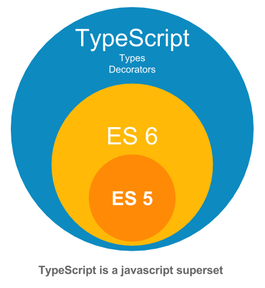

Reference: MDN, [LearnXInYMinutes](https://learnxinyminutes.com/docs/javascript/),

More readings: [JS Design Pattern](https://addyosmani.com/resources/essentialjsdesignpatterns/book/), 

 

## Background

JS Code runs in JS Engine which provides JIT compiler, GC, etc. 

- V8 compiles JS to machine code and use mark-sweep GC, see [here](https://blog.sessionstack.com/how-javascript-works-inside-the-v8-engine-5-tips-on-how-to-write-optimized-code-ac089e62b12e).

 

JS Engine like V8 can run in browser or independently.

- When in browser, DOM/BOM API is provided.

- When in nodeJS, correspond API is provided.

- They are not part of JS!

 

JS has standard called ECMAScript (ES) which is evolving to ES6.

- See [here](https://kangax.github.io/compat-table/es6/) for checking ES6 capatibility.



 

## Syntax

#### `let` vs `var`

- `var` is global-level or function-level, `let` is block-level.
- `var` is hoisted which can be unclear and confused.
- Using `let` is a better practice in ES6.
- `const` is like `let` except that `const` cannot be reassigned.


#### `null` vs `undefined`

- `undefined` means not assigned yet, access an undefined variable will cause error.
- `null` means leaving it void intentionally.
e.g.
let a = b || 1; // If b is undefined, an error raises. If b is null, a will be 1.


#### `==` vs `===`

- `==` does type conversion for you which can be confusing. See [here](https://developer.mozilla.org/en-US/docs/Web/JavaScript/Reference/Operators/Comparison_Operators#Equality_operators).
- `===` means strictly equality which is preferred.
- `!=` and `!==` are also different in the same way.
e.g.
`null == undefined` returns true, while `null === undefined` returns false.


#### Array

| create                                                       | let arr = [];                          |
| ------------------------------------------------------------ | -------------------------------------- |
| shallow copy                                                 | slice      Array.from                  |
| add                                                          | push, unshift,                         |
| delete                                                       | pop, shift, splice                     |
| find                                                         | indexof, lastIndexOf                   |
| [iteration](https://developer.mozilla.org/en-US/docs/Web/JavaScript/Reference/Global_Objects/Array#Iteration_methods) | foreach, find, map, reduce, filter,... |


`for ... in` vs `for...of`
- `of` is used to iterate through all the elements in an array.
- `in` is used to iterate through all the properties in an object.


#### function

- `function foo(param){ ... }  `

- `undefined` will be passed into foo if param is blank.

- "foo" can be omitted as an anonymous function.

- first-class object, so function can be reassigned with different names.

 

#### closure

- closure is used to associate some data with a function, similar to object with one method in OOP. It's useful especially in Event-driven programming.

  e.g.

  ```js
  function createClosure(outParam)
  {
  	let innerParam = 1;
  	function innerFunc(val)
  	{
  		innerParam += val;
  	}
  	return {
  		increment: function(){ innerFunc(1);}
  		decrement: function(){ innderFunc(-1);}
  		value: function(){ return innerParam;}
  	}
  }
  var counter = new createClosure();
  counter.increment();
  counter.increment();
  ```

 

## OOP in JS

everything is object, except `null` and `undefined`

#### new an object:

```js
let a = {}; // equals to : let a = Object.create(Object.prototype);
let a = Object.create(null); // a pure empty object
let a = {name: "jojo"};
```

#### add/remove property to object:

```js
a.name = "jojo";
a["name"] = "jojo";
delete a.name
```

Also use `Object.defineProperty(obj, prop, descriptor)` to put more restrictions (`configurable, enumerable, writable, value, get, set`, see [here](https://developer.mozilla.org/en-US/docs/Web/JavaScript/Reference/Global_Objects/Object/defineProperty)).

A equivalence to `a.name = "jojo";` is:

```js
Object.defineProperty(a, 'name', {
	value: "jojo",
	writable : true,
	configurable : true,
	enumerable: true}
);
```


#### keyword `this`

A function can use `this` to refer to the caller's context, even it is not the object's method. 

This can be achieved in 2 ways.

- Pass `this` into function every time.

  ```js
  const foo = function(str){ return this.name + str; }
  let obj = {name:"jojo"}
  foo.call(obj, " wins");    //pass obj as this. return "jojo wins"
  foo.apply(obj, [" wins"]); //same as call, except that 2nd param is an array
  ```

-  Bind `this` to function to create a new function.

  ```js
  const foo = function(str){ return this.name + str; }
  let obj = {name:"jojo"}
  const fooThis = foo.bind(obj);
  fooThis(" wins");
  ```


#### keyword `new`

If call a function with `new`, a new object is created and the function can access the object via `this`.

e.g.

```js
const constructor = function(){ this.age = 1; }
var a = constructor();// a will be undefined.
var a = new constructor(); //a will be an object with property 'age' set to 1.
```


#### no class but prototype

Traditional OOP use class as blueprint, JS combines instantiation & inheritance by prototype-chain. Every object has a property called `__proto__`, which means when you access the property or method not in object `a`, JS will search in `a.__proto__` upward, until `__proto__ === null`.

Prototype is binded in 2 ways and always shared by reference.

- Use `Object.create`.

  ```js
  var obj = Object.create(myProtoTypeObj);  //earlier JS does not support this.
  ```

- Use constructor and `new`. 

  - Every function has a property called `prototype`. 

  - Notice: `__proto__` points to the prototype of itself, instead,  `prototype` will pass to the new objects as their prototype.

    ```js
    var parentObj = {lastName:' lee', getFullName : function(){return this.firstName + this.lastName;}};
    
    var ChildConstructor = function(name){ this.firstName = name;};
    ChildConstructor.prototype = parentObj;
    
    let son1 = new MyCons('jojo');     //son1.getFullName() will return 'jojo lee'
    let son2 = new MyCons('dio');      //son1.getFullName() will return 'dio lee'
    
    parentObj.attack = function(){}   //parent got new power
    son1.attack();  //all the child automatically "inherit" this power, without re-compile.
    ```

    In fact, `Object.create` can be simply writen as :

    ```js
    Object.create = function(protoObj){ 
    	var foo = function(){};
    	foo.prototype = protoObj;
    	return new foo(); 
    }
    ```

- syntatical sugar `class`.

  ES6 introduce `class`, `constructor`, `extends`, `super` to mimic traditional OOP, see [here](https://developer.mozilla.org/en-US/docs/Web/JavaScript/Reference/Classes) for usage.

  This may cause compatibility issue, see [here](https://developer.mozilla.org/en-US/docs/Web/JavaScript/Reference/Classes#Browser_compatibility).

 

#### deep-copy

- wrong way

  ```js
  var clone = JSON.parse(JSON.stringify(obj)); //lose unserializable properties like method.
  var clone = {...obj}; //shallow copy in ES6
  ```

- right way
  - use lodash library.
  - write by yourself.

 

## More topic on JS

- Memory Management & GC

- Concurrency & Event loop
- Package & Library
- Typescript
- NodeJS